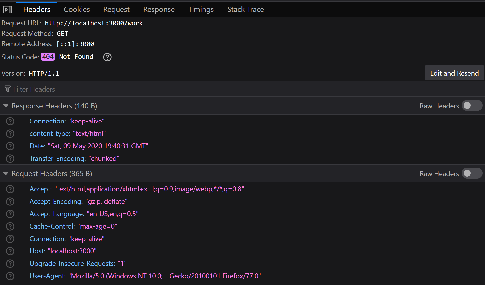

<style>
    body {
        color: white;
    }
    h1, h3 {
         /* offset-x | offset-y | blur-radius | color */
        box-shadow: 4px 4px 15px black;
         /* top | right | bottom | left */
        padding: 5px 5px 5px 5px;
        font-weight: bold;
    }

    h2 {
        border-left: 5px solid grey;
        padding-left: 10px;
        color: #4EDFB0;
    }
</style>
# Routing

```req.url``` | finds the requested URL
--------      |------------------------
```javascript
const http = require("http");
const url = require("url");

const server = http.createServer( function(req, res) {
    let pathName = req.url
    if (pathName === "/" || pathName === "/overview") {
        res.end("This is the overview page")
    } else if (pathName === "/product") {
        res.end("This is the product page")
    } else {
        res.writeHead(404, {
            "content-type": "text/html",
        });
        res.end("<h1>This page could not be found</h1>");
    }
})

server.listen(3000, function(){
    console.log("The server is running on port: 3000"); 
});
```
```req.writehead``` creates a status code of 404 and a response header inside the dev tools under the network tab 
